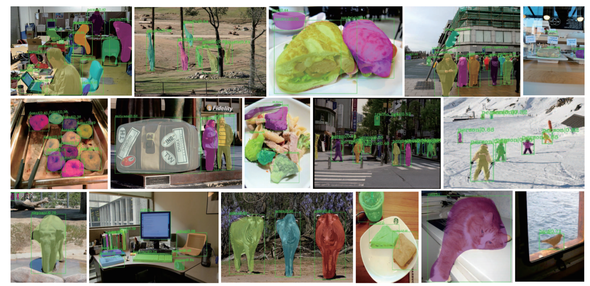
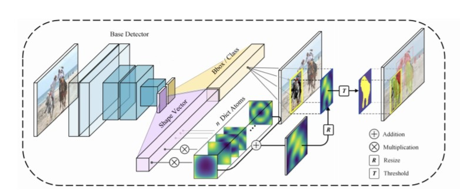

# USD-Seg
This project is an implement of paper [USD-Seg:Learning Universal Shape Dictionary for Realtime Instance Segmentation](https://arxiv.org/abs/2012.01050), based on FCOS detector from MMDetection tool box.

## Introduction
<!--  -->
We present a novel explicit shape representation for instance segmentation.
The proposed USD-Seg adopts a linear model, sparse coding with dictionary, for object shapes.
First, it learns a dictionary from a large collection of shape datasets, making any shape being able to be decomposed into a linear combination through the dictionary.
Hence the name "Universal Shape Dictionary".
It adds a simple shape vector regression head to ordinary object detector, giving the detector segmentation ability with minimal overhead.




## License

This project is released under the [Apache 2.0 license](LICENSE).


## Model
The overall pipeline of USD-Seg: an RGB image is input to the base detector, and the base detector will regress
both detection related information (bounding box and class) and the shape vector. Then the mask will be decoded by simple
multiplication between shape vector and dictionary atoms, followed by proper resize and threshold operations.

## Installation
Please refer to [INSTALL.md](docs/INSTALL.md) for installation and dataset preparation.
## Get Started
Please see [GETTING_STARTED.md](docs/GETTING_STARTED.md) for the basic usage of MMDetection.  
We follow the original usage of mmdetection framework. You can use configs for usd-seg in `/configs/usdseg/` to train from scratch.


## Citation

If you use this toolbox or benchmark in your research, please cite this project and mmdetection.
```
@article{USD-Seg,
  title   = {Learning Universal Shape Dictionary for Realtime Instance Segmentation},
  author  = {Tang, Tutian and Xu, Wenqiang and Ye, Ruolin and Yang, Lixin and Lu, Cewu},
  journal= {arXiv preprint arXiv:2012.01050},
  year={2020}
}
```


## Contact

This repo is currently maintained by Tutian tang ([@ElectronicElephant](http://github.com/ElectronicElephant))and Ruolin Ye ([@YoruCathy](https://github.com/YoruCathy)). Other core developers include Wenqiang Xu ([@WenqiangX](https://github.com/WenqiangX)). For technical details, please feel free to contact the authors directly via Email.
